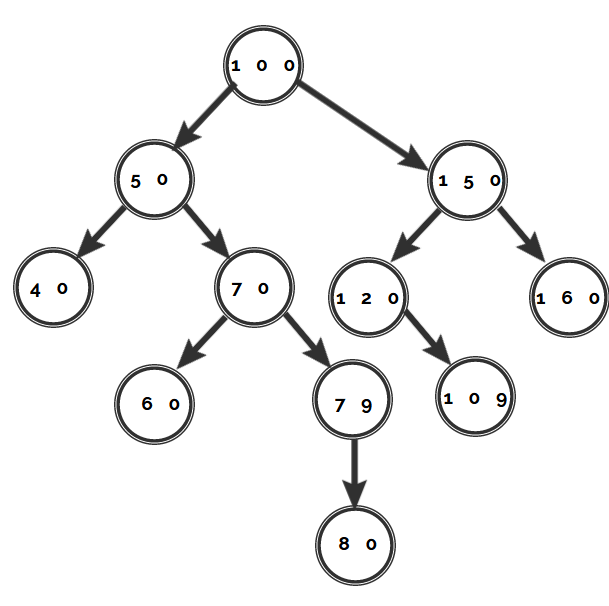

# Interview Preparation

A useful resource to prepare for Software Engineering interviews.

## What can I find in this repository?

- Algorithm implementations.
- Solved problems common in interview settings. 
- Data structures.
- etc.

## Can I add new material to this repository?

Sure, just send a MR and I'll review it.

## Author

Roxana Anabel Lafuente.

- <i>Passionate Python Software Developer</i>.
- About me: I like programming, traveling and learning languages. If you are curious about my work, visit my website [Lingua-e](http://www.lingua-e.com) to learn English.
